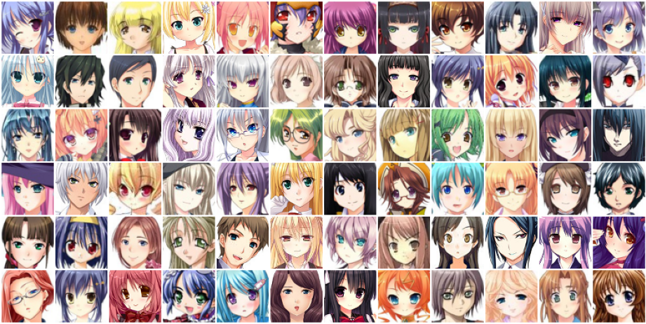
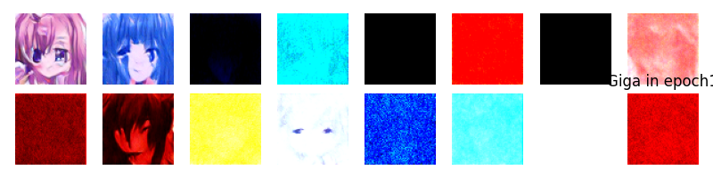
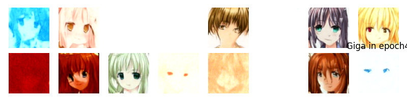
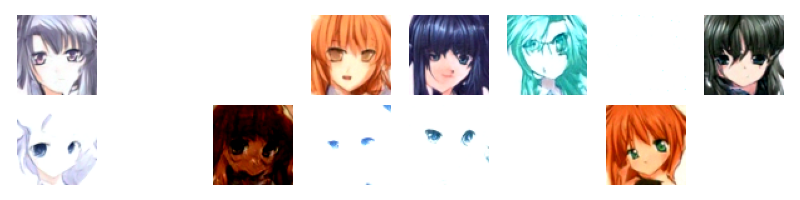
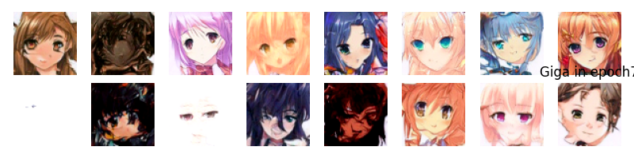
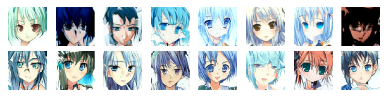
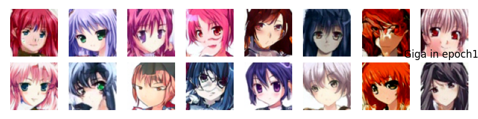
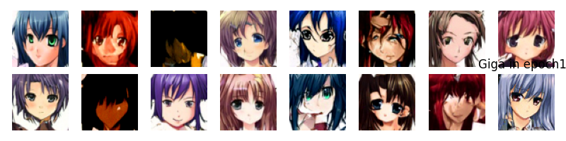
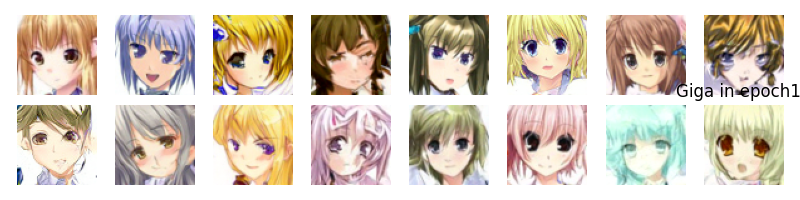
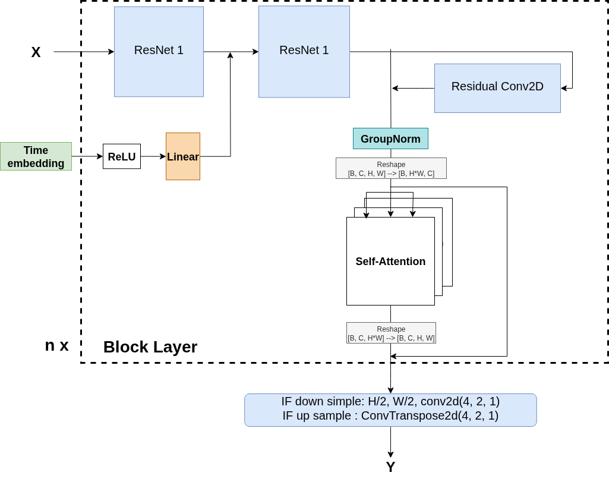

# Anime Face Generator using Diffusion Model


<a target="_blank" href="https://cookiecutter-data-science.drivendata.org/">
  
</a>


<!-- <hr/> -->


<div align="center">
  
</div>

For this project we build a generative deep learning system that can generate anime faces. The system will be trained on a dataset of anime faces and will use denoising diffusion probabilistic models (DDPM) to generate new faces. The goal is to create a system that can generate acceptable quality anime faces that are diverse and realistic by drawing samples, and naturally for denoising by encoding-decoding the image. The project will also explore the use of different architectures and the impact of self-attention on standard DDPM to improve the quality of the generated faces.

Through this project, we:
- Collected and preprocessed over 80,000 anime face images, applying normalization, resizing, and a few augmentations.
- Designed and trained two distinct deep learning models, mainly noise prediction technique and a quick view on score-based energy model, experimenting with different architectures and training strategies.

To see the "conference style" report click on the following GitHub link:  
<a href="https://github.com/Ayoub-Vip/anime_face_generator/blob/master/reports/report.pdf">
 https://github.com/Ayoub-Vip/anime_face_generator/blob/master/reports/report.pdf
</a>

## Some Generated Images

Here are the results of Giga model (85M parameters) for epochs 1, 4, 5, 7, 9, 10, 13, and 16:

<div align="center">
  
  
  
  
  
  
  
  
</div>

## Model Architecture

<div align="center">
  
</div>


## Project Organization

```
├── LICENSE            <- Open-source license if one is chosen
├── Makefile           <- Makefile with convenience commands like `make data` or `make train`
├── README.md          <- The top-level README for developers using this project.
├── data
│   ├── external       <- Data from third party sources.
│   ├── interim        <- Intermediate data that has been transformed.
│   ├── processed      <- The final, canonical data sets for modeling.
│   └── raw            <- The original, immutable data dump.
│
├── docs               <- A default mkdocs project; see www.mkdocs.org for details
│
├── models             <- Trained and serialized models, model predictions, or model summaries
│
├── notebooks          <- Jupyter notebooks. Naming convention is a number (for ordering),
│                         the creator's initials, and a short `-` delimited description, e.g.
│                         `1.0-jqp-initial-data-exploration`.
│
├── pyproject.toml     <- Project configuration file with package metadata for 
│                         anime_face_generator and configuration for tools like black
│
├── references         <- Data dictionaries, manuals, and all other explanatory materials.
│
├── reports            <- Generated analysis as HTML, PDF, LaTeX, etc.
│   └── figures        <- Generated graphics and figures to be used in reporting
│
├── requirements.txt   <- The requirements file for reproducing the analysis environment, e.g.
│                         generated with `pip freeze > requirements.txt`
│
├── setup.cfg          <- Configuration file for flake8
│
└── anime_face_generator   <- Source code for use in this project.
    │
    ├── __init__.py             <- Makes anime_face_generator a Python module
    │
    ├── config.py               <- Store useful variables and configuration
    │
    ├── dataset.py              <- Scripts to download or generate data
    │
    ├── modeling                <- Contrains models, training and tuning code
    |   |
    │   ├── __init__.py 
    │   ├── generate.py          <- Code for denoising or generating images with trained models          
    │   ├── train.py            <- Code to train models
    │   │
    |   └── models              <- Contains models
    |       ├── 10M-Dummy_Unet_DDPM
    |       ├── 48M_Simple_Unet_DDPM
    |       ├── 75M_Mega_Unet_DDPM
    |       ├── 85M_Giga_Unet_edited_DDPM
    |       └── 85M_Giga_Unet_Score_Based_EDM
    │
    └── plots.py                <- Code to create visualizations
```

--------

